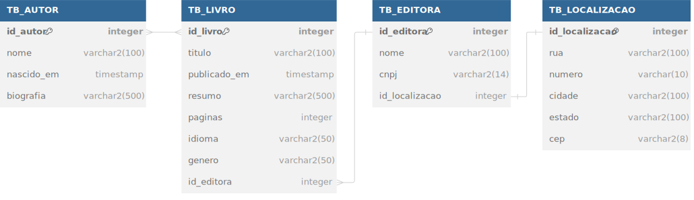

# 📚 nBooks

## 💡Explicação do projeto
Uma aplicação Spring Boot que oferece funcionalidades para gerenciar informações sobre livros, autores e editoras visando conceitos de relacionamentos utilizando Spring Data JPA.

## 💻 Tecnologias
O back-end Java do projeto está sendo desenvolvido desenvolvido utilizando as seguintes tecnologias:

- [Java 17+](https://www.oracle.com/java/technologies/javase/jdk17-archive-downloads.html)
- [Maven](https://maven.apache.org/)
- [Lombok](https://projectlombok.org/)
- [Spring Boot](https://spring.io/projects/spring-boot)
- [Spring Web](https://spring.io/web-applications)
- [Spring Data JPA](https://spring.io/projects/spring-data-jpa)
- [Spring Validation](https://docs.spring.io/spring-framework/docs/current/reference/html/core.html#validation)
- [Oracle Driver](https://www.oracle.com/br/database/technologies/appdev/jdbc.html)

## ⚙️ Como executar a aplicação

Para executar a aplicação, siga estas etapas:

1. **Clone o repositório:**
   ```bash
   git clone https://github.com/ericknathan/nBooks.git
   ```

2. **Acesse o diretório do projeto:**
   ```bash
   cd nBooks
   ```

3. **Instale as dependências:**
   Certifique-se de ter o Maven instalado. Em seguida, execute:
   ```bash
   mvn install
   ```

4. **Configure o banco de dados:**
   Configure as credenciais do banco de dados no arquivo `application.properties`.

5. **Execute a aplicação:**
   ```bash
   mvn spring-boot:run
   ```

Agora, a aplicação está em execução localmente em seu ambiente.

## 📄 Documentação
Você pode fazer o download e executar a documentação no Insomnia clicando no botão a seguir:

[](https://insomnia.rest/run/?label=nBooks%20API&uri=https%3A%2F%2Fgithub.com%2Fericknathan%2FnBooks%2Fblob%2Fmain%2FDOCUMENTACAO.json)

## 📊 Modelagem do banco de dados
